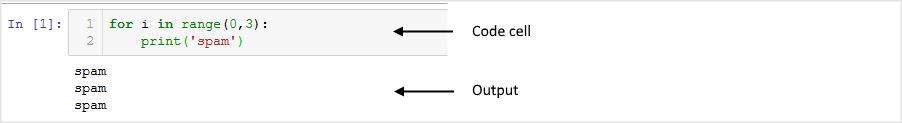
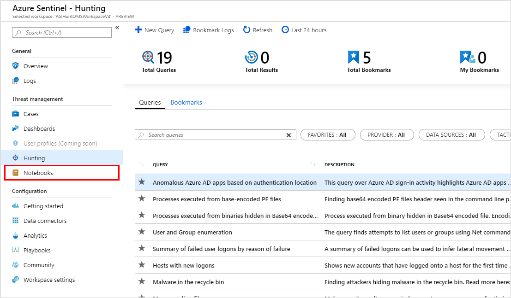
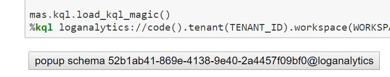

What is Jupyter?
================

Jupyter is an interactive development and data manipulation environment
hosted in a browser. It takes code that you type into a cell, executes
it and returns the output to you. Here is an example:

For more introductory information and sample notebooks go to
[jupyter.org](https://jupyter.org). and the [jupyter introductory
documentation](https://jupyter.readthedocs.io/en/latest/tryjupyter.html)

Why Jupyter?
============

\"Why would I use Jupyter notebooks to work with Azure Sentinel data
rather than the built-in query and investigation tools?\" might be your
first question. And the first answer is that, usually, you wouldn\'t. In
most cases, the scenario and data that you are investigating can be
handled perfectly well in with the coming graphical investigation tool,
with Log Analytics queries and cool case features like Bookmarks.

One reason that you might want to reach for Jupyter is when the
complexity of what you are looking for becomes too high. "How complex is
*too complex*?\" is a difficult question to answer but some guidelines
might be:

-   when the number of queries in your investigation chain goes beyond
    around 7 (the number of things that the average person can juggle in
    short-term memory).

-   when you start to need extra-strength reading glasses to see all the
    detail of the investigation graph.

-   when you discover that your browser has just crashed and you hadn\'t
    saved any of the queries or results that you were working on.

Some of the other benefits of working in Jupyter are outlined in the
following sections.

Data Persistence, Repeatability and Backtracking
------------------------------------------------

One of the painful things when working on a more complex security
investigation is keeping track of what you have done. You might easily
find yourself with tens of queries and results sets - many of which
turned out to be dead ends. Which ones do you keep? How easy is it to
backtrack and re-run the queries with different values or date ranges?
How do you accumulate the useful results in a single report? What if you
want to re-run the same pattern on a future investigation?

With most data-querying environments the answer is a lot of manual work
and heavy reliance on good short-term memory. Jupyter, on the other
hand, gives you a linear progression through the investigation - saving
queries and data as you go. With the use of variables through the
progression of the queries (e.g. for time ranges, account names, IP
addresses, etc.) it also makes it much easier to backtrack and re-run
and to reuse the entire workflow in future investigations.

Joining to External Data
------------------------

Most of your telemetry/event data will be in Azure Sentinel workspace
tables but there will often be exceptions:

-   data in an external service that you do not own - e.g. IP whois and
    geolocation data, threat intelligence source,

-   sensitive data that may only be stored within your organization - HR
    Database, lists of execs, admins or high-value assets,

-   or simply data that you have not yet migrated to the cloud.

Any data that is accessible over your network or from a file can be
linked with Azure Sentinel data via Python and Jupyter.

Access to Complex Processing and Visualization
----------------------------------------------

Azure Sentinel and the Kusto/Log Analytics data store underlying it have
a lot of options for visualization and advanced data processing (even
clustering, windowed statistical and machine learning functions) and
more capabilities are being added all the time. However, there may be
times when you need something different: specialized visualizations,
machine learning libraries or even just data processing and
transformation facilities not available in the Azure Sentinel platform.
You can see examples of these in some of the Azure Sentinel sample
notebooks (see References at the end of the document).

Why Python?
===========

Jupyter can be used with many different languages - what makes Python a
good choice?

Popularity
----------

It is very likely that you already have Python coders in your
organization. It is now the most widely taught language in Computer
Science courses and used widely in many scientific fields. It is also
frequently used by IT Pros -- where it has largely replaced perl as the
go-to language for scripting and systems management -- and by web
developers (many popular services such as DropBox and Instagram are
almost entirely written in Python).

Ecosystem
---------

Driven by this popularity, there is a vast repository of python
libraries available on [PyPi](https://pypi.org) and nearly 1 million
python repos on [Github](https://github.com/search?q=python). For many
of the tools that you need as a security investigator - data
manipulation, data analysis, visualization, machine learning and
statistical analysis - no other language ecosystem has comparable tools.

One remarkable point here is that pretty much every major python package
and the core language itself are open source and written and maintained
by volunteers.

### Running Python Code in a Kusto Query

An interesting feature for the Azure Sentinel Kusto (a.k.a. Log
Analytics) data store that was recently released to public preview is
the ability to run python code as part of a Kusto query. For more
information see this
[document](https://kusto.azurewebsites.net/docs/query/pythonplugin.html).

Alternatives to Python
----------------------

You can use other language kernels with Juypter, and you can mix and
match languages (to a degree) within the same notebook using \'magics\'
that allow execution of individual cells using another language. For
example, you could retrieve data using a PowerShell script cell, process
the data in python and use JavaScript to render a visualization. In
practice, this can be a little trickier than it sounds but certainly
possible with a bit of hand-wiring.

Getting Started with Azure Sentinel and Jupyter notebooks
=========================================================

Creating a notebooks project within [Azure
Notebooks](https://notebooks.azure.com/) is directly supported by Azure
Sentinel. Click on the notebook icon in the Azure Sentinel main
navigation menu. From here you have the option to create a new project
from our GitHub repo or just open your existing Azure Notebooks project.
Azure Notebooks is a
[Jupyterhub](https://jupyterhub.readthedocs.io/en/stable/)
implementation and has a free tier that you can use for any notebook
tasks.

If you have a local installation of Python 3.6 or later, you can also
download the notebooks and run these locally. My personal recommendation
is to use the [Anaconda](https://www.anaconda.com/distribution/)
distribution since it contains the Jupyter packages and many others
needed for the Azure Sentinel notebooks.

Further reading: [Using Notebooks in Azure
Sentinel](https://docs.microsoft.com/en-us/azure/sentinel/notebooks) and
.

### Open one of the Sample Notebooks

If you have cloned the Azure Sentinel repo you already have several
notebooks in your Notebooks for Azure Project -- in the notebooks and
notebooks/samples folders. Most of the notebooks in the samples folders
(anything that begins with "Example") have data is saved with them so
you can the expected output without having access to a data source. I
strongly recommend viewing the notebook using nbviewer.org. This seems
to have magical powers to render data and interactive JavaScript
controls that are displayed incorrectly even when viewing a notebook
locally. The GitHub notebook viewer is reasonable for simple notebooks
but not very sophisticated. Here is a link to one of the notebooks
displayed in
[nbviewer](https://nbviewer.jupyter.org/github/Azure/Azure-Sentinel/blob/master/Notebooks/Sample-Notebooks/Example%20-%20Step-by-Step%20Linux-Windows-Office%20Investigation.ipynb).

Note: you do not need to have Python or any of the dependencies
installed to view notebooks in nbviewer or GitHub.

Notebook Setup
--------------

When it comes to running one of the notebooks in against real data, you
will need some preparatory steps.

### Permissions in your Azure Sentinel/Log Analytics Workspace

In order to read any data, you will need to have at least LogAnalytics
Reader role for your account.

### Configuring your Python Environment for the First Time

You will need to carry out this procedure every time you start working
in a fresh Python environment.

If you are using Notebooks for Azure using free computer, creating a new
project is effectively starting a new environment (although there are
ways to automate this setup). The exception to this is if you are using
a dedicated Compute resource such as a [Data Science Virtual
Machine](https://azure.microsoft.com/en-us/services/virtual-machines/data-science-virtual-machines/).
Since this machine is persisted and linked to your Notebooks for Azure
account, all the configuration will be there next time you come to use
it.

If you are working locally or using another Jupyterhub hosted
environment, you will only need to do this environment configuration for
each fresh install or when you create a new python or conda virtual
environment.

#### Steps

1.  Ensure that you have a version of Python 3.6 or later.

2.  Install the two main packages used by the notebook: Kqlmagic and
    msticpy (see references at end of document). These will install most
    of the dependencies needed by the notebooks if they are not already
    installed.

3.  Install one or two additional python packages -- these vary
    depending on the notebook.

If you are running on a Windows machine where Python is installed for
All Users, you may have to add the --user flag to the pip install
commands. You will see permission failures when trying to install if
this is the case.

> `pip install --``user`` <``pkg_name``>`

Notes for Conda users.

If you are running in a Conda environment (an Anaconda distribution) run
the pip commands from a Conda prompt, ideally in a dedicated Conda
virtual environment. Just start an Anaconda prompt shell, paste the pip
install commands into it and execute them, rather than running them from
the notebook. You will need to run Jupyter from the same environment.
More details of can be found
[here](https://www.anaconda.com/using-pip-in-a-conda-environment/).

#### Keeping the packages up-to-date

It is a good idea to force an update of packages at regular intervals
using

> `pip install --upgrade <``pkg_name``>`

to ensure that you have the latest features and fixes (including fixes
for security vulnerabilities).

### Notebook Initialization

There are two main pieces of housekeeping here that you need each time a
notebook is started:

1.  Importing python libraries (this is reading in the installed
    versions of the libraries so that they become accessible in your
    python session). I try to keep all of the imports at the start of my
    notebooks so that you have an early warning of missing dependencies.

<!-- -->

2.  Authenticating to Azure Sentinel/Log Analytics with Azure Active
    Directory. This is a complex topic but there are two main methods of
    authentication:

-   Interactive device/user authentication - this prompts you for user
    credentials and a one-time device code. While this frees you from
    having to worry about saving/pasting in credentials each time, you
    do suffer a multi-prompt authentication experience. If you happen to
    be working a long time in a single notebook this is not too onerous
    but can be frustrating if you are hopping between multiple
    notebooks.

-   [AppId
    authentication](https://docs.microsoft.com/en-us/azure/active-directory/develop/howto-create-service-principal-portal) -
    this uses an App account, created in your Azure Active Directory
    tenant, and granted read access to your Log Analytics workspace.
    This is a smoother authentication experience but means that you need
    to manage the app client secret (and, hopefully, avoid leaving a
    copy of it in a notebook uploaded to GitHub!).

On successful authentication you should see a button displayed. Clicking
this brings up a pop-up of the schema of all the tables your workspace
and is a useful reference feature. This feature is also accessible from
the notebook Help menu.

References
==========

-   The [msticpy](https://github.com/Microsoft/msticpy) Python package
    containing tools used in these notebooks developed engineers on the
    Microsoft Threat Intelligence team. It is available on
    [GitHub](https://github.com/Microsoft/msticpy) along with several
    notebooks documenting the use of the tools and on
    [PyPi](https://pypi.org/project/msticpy/).

-   [Kqlmagic](https://github.com/Microsoft/jupyter-Kqlmagic) is a
    Jupyter-friendly package developed by Michael Binstock.

-   [Using Notebooks in Azure
    Sentinel](https://docs.microsoft.com/en-us/azure/sentinel/notebooks)
    is the official documentation for using Jupyter notebooks in Azure
    Sentinel.

-   is a Jupyter notebook that demonstrates the use of Kqlmagic to
    retrieve data from Azure Sentinel.

-   

Notebooks
---------

-   [Automating Security Operations Using Windows Defender ATP APIs with
    Python and Jupyter
    Notebooks](https://techcommunity.microsoft.com/t5/Windows-Defender-ATP/Automating-Security-Operations-Using-Windows-Defender-ATP-APIs/ba-p/294434)
    by John Lambert

-   Azure Sentinel sample Jupyter notebooks can be found
    [here](https://github.com/Azure/Azure-Sentinel) on GitHub.

-   Windows Alert Investigation
    in [github](https://github.com/Azure/Azure-Sentinel/blob/master/Notebooks/Sample-Notebooks/Example%20-%20Guided%20Investigation%20-%20Process-Alerts.ipynb) or [NbViewer](https://nbviewer.jupyter.org/github/Azure/Azure-Sentinel/blob/master/Notebooks/Sample-Notebooks/Example%20-%20Guided%20Investigation%20-%20Process-Alerts.ipynb)

-   Windows Host Explorer
    in [github](https://github.com/Azure/Azure-Sentinel/blob/master/Notebooks/Sample-Notebooks/Example%20-%20Guided%20Hunting%20-%20Windows-Host-Explorer.ipynb) or [NbViewer](https://nbviewer.jupyter.org/github/Azure/Azure-Sentinel/blob/master/Notebooks/Sample-Notebooks/Example%20-%20Guided%20Hunting%20-%20Windows-Host-Explorer.ipynb)

-   Office 365 Exploration
    in [github](https://github.com/Azure/Azure-Sentinel/blob/master/Notebooks/Sample-Notebooks/Example%20-%20Guided%20Hunting%20-%20Office365-Exploring.ipynb) or [NbViewer](https://nbviewer.jupyter.org/github.com/Azure/Azure-Sentinel/blob/master/Notebooks/Sample-Notebooks/Example%20-%20Guided%20Hunting%20-%20Office365-Exploring.ipynb)

-   Cross-Network Hunting
    in [github](https://github.com/Azure/Azure-Sentinel/blob/master/Notebooks/Sample-Notebooks/Example%20-%20Guided%20Hunting%20-%20Linux-Windows-Office.ipynb) or [NbViewer](https://nbviewer.jupyter.org/github/Azure/Azure-Sentinel/blob/master/Notebooks/Sample-Notebooks/Example%20-%20Guided%20Hunting%20-%20Linux-Windows-Office.ipynb)
